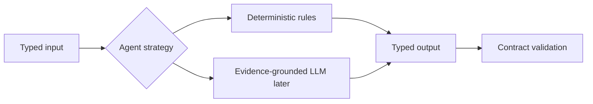

# Agent Strategy Model

## Strategy Principle

An agent strategy is an internal method for producing a typed output. The external contract is stable even when the internal strategy changes.

## Initial Deterministic Strategies

Initial agents must use deterministic strategies based on:

- rules;
- structured question parsing;
- metadata;
- dataset retrieval;
- statistical analysis;
- validation logic;
- evidence aggregation;
- report templates.

These strategies are preferred first because they are auditable, testable, and reproducible.

## Evidence-Grounded LLM Strategies

Selected agents may later use LLM strategies when language reasoning materially improves:

- question interpretation;
- research decomposition;
- hypothesis generation;
- criticism;
- contextualization;
- synthesis.

LLM use must be evidence-grounded. Inputs must include explicit source references, agent outputs, artifact fields, or retrieved context. Outputs must cite the fields used and pass validation before entering the artifact.

## Prohibited LLM Behavior

LLMs must not:

- invent evidence;
- silently introduce unsupported claims;
- calculate authoritative statistics instead of the analytical engine;
- override deterministic analytical outputs;
- independently assert causal conclusions;
- conceal uncertainty or contradictory evidence.

## Contract Stability

Changing the strategy must not require downstream agents to change their input expectations.
