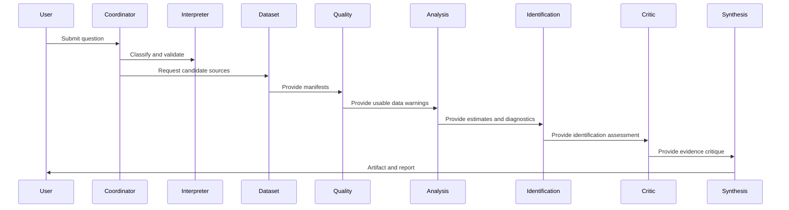

# Multi-Agent Design

## Architectural Decision

Polaris is inherently multi-agent. Multi-agent orchestration is mandatory because societal research requires separable responsibilities: question interpretation, data selection, domain review, quality assessment, analysis, identification, criticism, and synthesis.

This is valuable before LLMs are introduced. Deterministic agents make responsibilities testable, isolate failures, and produce structured contributions that can be audited independently.

## Orchestration Flow

## Agent Contracts

Every agent must use typed structured inputs and outputs. Required contract fields include:

- investigation identifier;
- artifact version;
- input references;
- output payload;
- provenance references;
- uncertainty or warning fields;
- validation status;
- errors or stop conditions.

An agent's internal reasoning strategy may change without changing its external contract.

## Initial Agent Roles

Research Coordinator Agent: owns investigation state, routes work, enforces stop conditions, and ensures artifact/report generation.

Question Interpretation Agent: parses questions, classifies evidence type, identifies missing metadata, and detects causal wording.

Dataset Selection Agent: maps question requirements to candidate datasets and records source fit, licensing, coverage, and access warnings.

Governance Agent: evaluates governance and institutional indicators, including construct validity and comparability warnings.

Economics Agent: evaluates macroeconomic, labor, fiscal, trade, and development indicators.

Education Agent: evaluates education indicators, assessment comparability, administrative coverage, and learning-measure limitations.

Public Health Agent: evaluates health indicators, facility-data warnings, surveillance differences, and population denominators.

Society and Social Trust Agent: evaluates survey-based trust, values, cohesion, and social-attitude indicators.

Demographics Agent: evaluates population, migration, fertility, mortality, age-structure, and denominator issues.

Environment Agent: evaluates environmental exposure, climate, land, pollution, and resource indicators.

Innovation Agent: evaluates research, technology, patents, productivity, and knowledge-economy indicators.

Conflict Agent: evaluates conflict-event, violence, fragility, and political-risk data with special attention to reporting bias.

Historical Context Agent: supplies bounded contextual information with provenance and without overriding empirical outputs.

Data Quality Agent: evaluates coverage, missingness, revisions, comparability, quality flags, and transformation risks.

Statistical Analysis Agent: executes deterministic statistical specifications and returns estimates, uncertainty, diagnostics, and warnings.

Causal Identification Agent: evaluates identification strategy, assumptions, threats, and whether causal language is supportable.

Evidence Critic Agent: challenges robustness, evidence quality, unsupported interpretation, conflicting findings, and practical significance.

Research Synthesis Agent: generates the artifact-backed report and separates evidence from interpretation.

## Incremental Introduction

The target architecture includes all roles above, but they do not need to be implemented in the first software phase. Initial phases should implement the smallest deterministic subset needed for a reproducible investigation.
