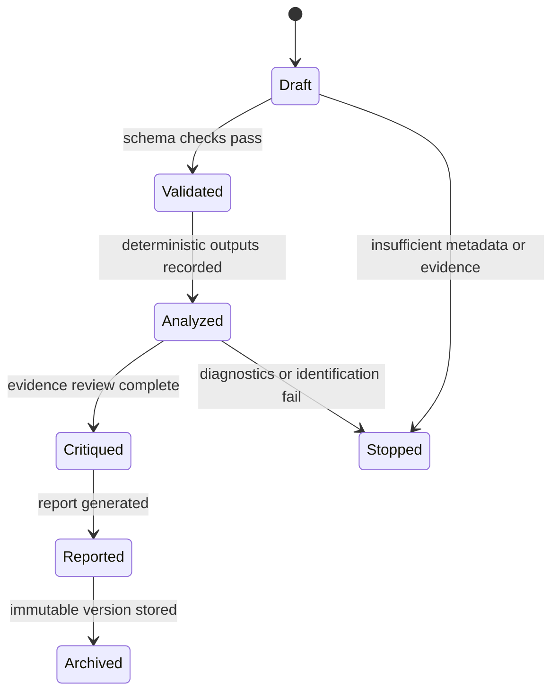

# Research Artifact Schema

## Purpose

Every Polaris investigation must generate a versioned machine-readable research artifact and a human-readable report. The report is derived from the artifact.

## Conceptual Artifact

Required top-level fields:

- artifact identifier;
- schema version;
- creation timestamp;
- research question;
- question classification;
- investigation plan;
- agent contributions;
- dataset manifests;
- provenance records;
- transformations;
- missing-data decisions;
- statistical specifications;
- model diagnostics;
- effect estimates;
- uncertainty;
- causal-identification assessment;
- robustness tests;
- conflicting findings;
- evidence-quality assessment;
- limitations;
- citations;
- reproducibility metadata;
- generated report reference.

## Separation of Evidence Types

Observed data: raw or source-provided values with source identifiers, access date, version, geography, time period, and unit.

Derived values: transformed, aggregated, imputed, normalized, linked, or modeled values with transformation lineage.

Model outputs: estimates, standard errors, confidence or credible intervals where applicable, diagnostics, specifications, and robustness outputs.

Narrative interpretation: report text generated from artifact fields, with references to the evidence used and explicit uncertainty.

## Agent Contributions

Each contribution must include:

- agent name and role;
- input references;
- output payload;
- strategy type;
- validation status;
- provenance references;
- warnings;
- error state when applicable.

## Lifecycle

## Reproducibility Metadata

The artifact must record source versions, retrieval timestamps, code versions, dependency versions when code exists, random seeds when random processes are used, execution environment metadata, and validation results.
