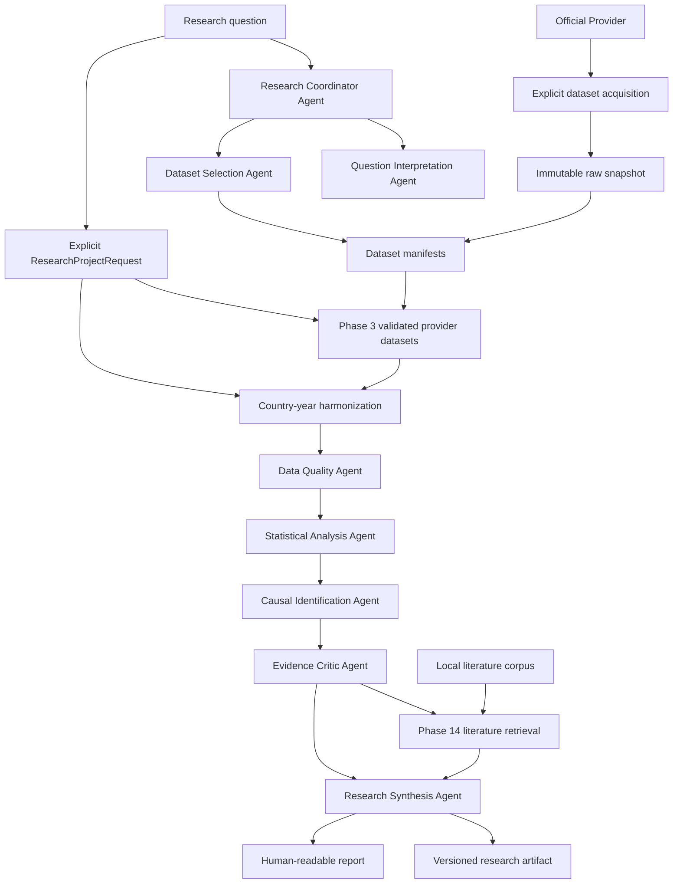

# System Overview

## Responsibilities

Polaris coordinates empirical investigations while preserving reproducibility, uncertainty, and methodological boundaries. The system is responsible for:

- classifying research questions;
- selecting candidate datasets;
- acquiring official public datasets as immutable local snapshots;
- recording provenance;
- running deterministic transformations and analyses;
- assessing data quality and causal-identification strength;
- synthesizing evidence without suppressing conflicts;
- generating versioned machine-readable artifacts and human-readable reports.

## High-Level Flow

## Deterministic Analytical Core

Data transformations, statistical calculations, causal estimates, diagnostics, and reproducible results remain deterministic. Agent strategies may vary internally, but external contracts must remain typed and structured.

## Dataset Acquisition

Provider access is an explicit pre-ingestion step. Polaris downloads or copies a provider file once, stores it under `data/raw/<provider>/`, records source URL, original filename, timestamp, byte size, format, and SHA-256 checksum, and generates a normal `DatasetManifest` under `data/manifests/`. Registry, ingestion, analysis, evidence, coordination, synthesis, and reporting operate from those local artifacts and do not require provider access after acquisition.

## Country-Year Harmonization

Phase 12 adds a deterministic layer between validated provider ingestion and analysis. It consumes immutable `DatasetIngestionResult` objects, explicit dataset configs, reviewed variable mappings, and a declared join type. It normalizes country and year identifiers, excludes aggregates from country-level joins by default, validates units and definitions, records duplicate keys and conflicts, tracks missingness reason codes, and preserves value-level provenance for each harmonized value. The output is a derived `HarmonizedDataset` that can be exported as a Phase 3-compatible CSV and manifest.

## Research Project Orchestration

Phase 13 adds a lightweight synchronous orchestration layer under `src/polaris/projects`. A `ResearchProjectRequest` explicitly names datasets or artifacts, optional harmonization configuration, a `StatisticalSpecification`, selected domain agents, synthesis settings, report settings, and optional literature configuration. `plan_research_project(...)` produces an inspectable deterministic execution plan. `run_research_project(...)` executes explicit stages: dataset resolution, ingestion, optional harmonization, analysis, evidence extraction, selected agents, coordination, optional literature retrieval, synthesis, reporting, and completion.

The orchestrator coordinates but does not analyze. It reuses existing Phase 3 ingestion, Phase 12 harmonization, Phase 4 analysis, Phase 5 evidence, Phase 6 agents, Phase 7 coordination, Phase 8 synthesis, and Phase 9 reporting services. Multiple datasets require explicit harmonization mappings. Statistical specifications are never generated from the research question. Agent selection is explicit and stored in deterministic order.

## Literature Context

Phase 14 adds a local corpus-grounded retrieval layer under `src/polaris/literature`. It ingests explicitly supplied TXT, Markdown, and structured JSON sources, computes source checksums, preserves citation metadata, normalizes text without mutating raw files, chunks deterministically, and indexes chunks with a deterministic BM25-style lexical retriever. Literature retrieval follows empirical evidence and coordination. It answers what supplied literature is relevant to Polaris claim IDs; it does not decide what the data should say, alter statistics, generate citations, or browse the web.

`LiteratureContextArtifact` remains separate from Phase 5 empirical evidence. Phase 8 synthesis receives it as optional context with explicit prompt separation between empirical findings and literature context. Phase 9 reports render a separate Literature Context section with citations, unmatched claims, retrieval facts, and limitations.

## WHO Health Panel

Phase 15 adds a curated WHO integration layer between raw provider snapshots and Phase 3 ingestion. It reads the local WHO GHO acquisition catalog, validates checksums, profiles indicator schemas, applies reviewed dimension filters, excludes aggregates, keeps sex and age dimensions explicit, separates projections from historical observations, and writes `WHOHealthPanel` artifacts. The panel is then exported as a normal Phase 3 dataset and consumed by Phase 12 without WHO-specific harmonization code.

## Failure Handling

The system must stop or downgrade claims when:

- required metadata is missing;
- source coverage is inadequate;
- data definitions are not comparable;
- missingness undermines interpretation;
- model diagnostics fail;
- identification assumptions are not defensible;
- robustness checks are unstable;
- sources conflict.

## Provenance Flow

Every dataset, transformation, model output, and narrative claim must link to provenance records. Reports are generated from artifacts, not from untracked agent memory.

Project-level provenance aggregates upstream identifiers and source checksums into one traceable chain from report back to source datasets. It references upstream provenance rather than replacing it.

## Technology Position

Candidate technologies are listed in [Technology Decisions](technology-decisions.md). Phase 0 does not commit to a production stack.
