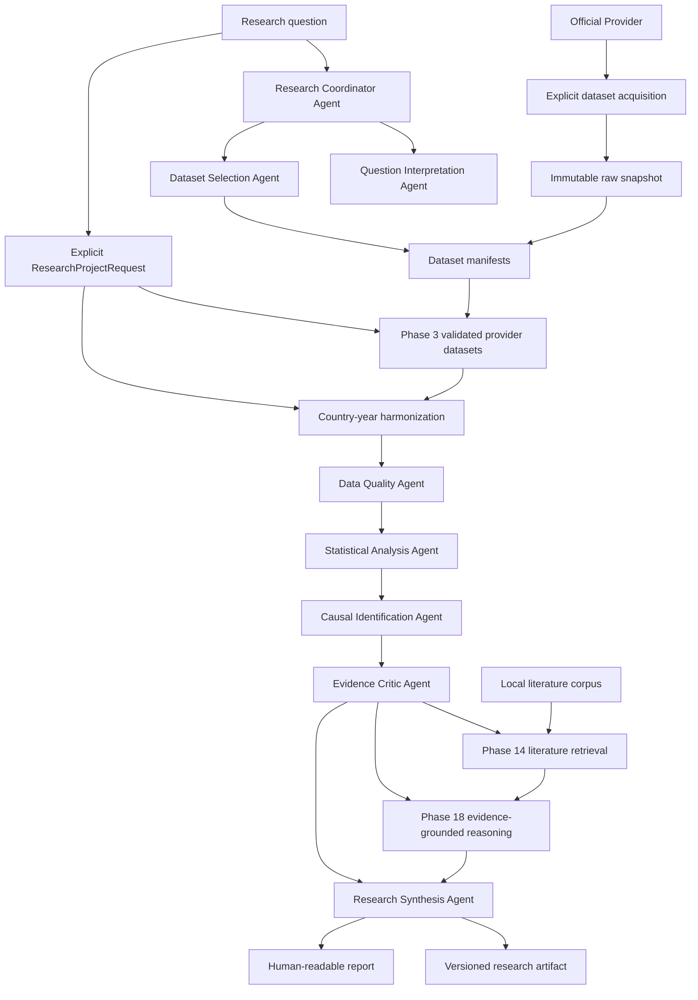

# System Overview

## Responsibilities

Polaris coordinates empirical investigations while preserving reproducibility, uncertainty, and methodological boundaries. The system is responsible for:

- classifying research questions;
- selecting candidate datasets;
- acquiring official public datasets as immutable local snapshots;
- recording provenance;
- running deterministic transformations and analyses;
- assessing data quality and causal-identification strength;
- synthesizing evidence without suppressing conflicts;
- generating versioned machine-readable artifacts and human-readable reports.

## High-Level Flow

## Deterministic Analytical Core

Data transformations, statistical calculations, causal estimates, diagnostics, and reproducible results remain deterministic. Agent strategies may vary internally, but external contracts must remain typed and structured.

Phase 21 extends the Phase 4 analytical core with panel regression methods for longitudinal country-year data. Harmonized data still enters through normal ingestion or project orchestration, then an explicit `StatisticalSpecification` declares entity/time keys, fixed effects, clustered standard errors, and lags. Results still leave through `AnalysisResult`, so evidence extraction, agents, reasoning, reports, project orchestration, and MCP do not need a separate panel pipeline.

Panel methods estimate non-causal longitudinal associations. Entity fixed effects account for stable entity differences; year fixed effects account for common period shocks; entity clustering represents repeated observations in uncertainty estimates. Cross-sectional dependence corrections and causal designs remain outside Phase 21.

## Dataset Acquisition

Provider access is an explicit pre-ingestion step. Polaris downloads or copies a provider file once, stores it under `data/raw/<provider>/`, records source URL, original filename, timestamp, byte size, format, and SHA-256 checksum, and generates a normal `DatasetManifest` under `data/manifests/`. Registry, ingestion, analysis, evidence, coordination, synthesis, and reporting operate from those local artifacts and do not require provider access after acquisition.

## Country-Year Harmonization

Phase 12 adds a deterministic layer between validated provider ingestion and analysis. It consumes immutable `DatasetIngestionResult` objects, explicit dataset configs, reviewed variable mappings, and a declared join type. It normalizes country and year identifiers, excludes aggregates from country-level joins by default, validates units and definitions, records duplicate keys and conflicts, tracks missingness reason codes, and preserves value-level provenance for each harmonized value. The output is a derived `HarmonizedDataset` that can be exported as a Phase 3-compatible CSV and manifest.

## Research Project Orchestration

Phase 13 adds a lightweight synchronous orchestration layer under `src/polaris/projects`. A `ResearchProjectRequest` explicitly names datasets or artifacts, optional harmonization configuration, a `StatisticalSpecification`, selected domain agents, optional reasoning settings, synthesis settings, report settings, and optional literature configuration. `plan_research_project(...)` produces an inspectable deterministic execution plan. `run_research_project(...)` executes explicit stages: dataset resolution, ingestion, optional harmonization, analysis, evidence extraction, selected agents, coordination, optional literature retrieval, optional reasoning, synthesis, reporting, and completion.

The orchestrator coordinates but does not analyze. It reuses existing Phase 3 ingestion, Phase 12 harmonization, Phase 4 analysis, Phase 5 evidence, Phase 6 agents, Phase 7 coordination, Phase 8 synthesis, and Phase 9 reporting services. Multiple datasets require explicit harmonization mappings. Statistical specifications are never generated from the research question. Agent selection is explicit and stored in deterministic order.

## Literature Context

Phase 14 adds a local corpus-grounded retrieval layer under `src/polaris/literature`. It ingests explicitly supplied TXT, Markdown, and structured JSON sources, computes source checksums, preserves citation metadata, normalizes text without mutating raw files, chunks deterministically, and indexes chunks with a deterministic BM25-style lexical retriever. Literature retrieval follows empirical evidence and coordination. It answers what supplied literature is relevant to Polaris claim IDs; it does not decide what the data should say, alter statistics, generate citations, or browse the web.

`LiteratureContextArtifact` remains separate from Phase 5 empirical evidence. Phase 8 synthesis receives it as optional context with explicit prompt separation between empirical findings and literature context. Phase 9 reports render a separate Literature Context section with citations, unmatched claims, retrieval facts, and limitations.

## Evidence-Grounded Reasoning

Phase 18 adds an optional reasoning layer under `src/polaris/reasoning`. It consumes structured Phase 5 evidence and claims, Phase 7 coordination, and optional Phase 14 literature context. It does not inspect raw datasets, select new datasets, run new statistics, or mutate evidence.

`ReasoningStatement` records distinguish empirical interpretations from cross-domain synthesis, plausible mechanisms, alternative explanations, candidate confounders, contradictions, limitations, uncertainty, follow-up hypotheses, follow-up research questions, literature alignment, and literature contrast. Every statement must cite upstream evidence, claim, assessment, or literature evidence IDs. Mechanisms are labeled unproven with `causal_status=not_established`; causal conclusions remain prohibited without future upstream causal identification.

Deterministic reasoning is the default offline baseline. Provider-backed reasoning is optional and must return structured output that passes grounding, causal-language, fabricated-citation, policy, and medical guardrails. Phase 8 can summarize a supplied `ReasoningArtifact`, and Phase 9 can render it as an Evidence-Grounded Interpretation section.

## Reasoning Evaluation

Phase 19 adds a separate evaluation path under `src/polaris/evaluation`:

`BenchmarkCase -> Evidence/Coordination/Literature fixtures -> reasoning mode -> ReasoningArtifact -> evaluation rules -> ReasoningEvaluationResult -> BenchmarkSuiteResult -> benchmark report`

Evaluation is not part of normal Phase 13 project execution by default. It is a benchmark
or post-project workflow that reads existing artifacts without mutating them. Evaluation
reports remain separate from research reports and summarize grounding, evidence fidelity,
causal restraint, epistemic calibration, contradiction handling, limitation propagation,
literature separation, structural validity, reproducibility, and deterministic/provider
comparison behavior.

## MCP Research Interface

Phase 20 adds an optional local integration boundary under `src/polaris/mcp`:

`External MCP client -> Polaris MCP server -> typed MCP adapters -> existing Polaris public APIs`

MCP resources are read-only views over dataset discovery, manifests, provider variable
catalogs, derived artifacts, reports, reasoning artifacts, evaluations, and provenance.
MCP tools are reserved for execution: listing or inspecting datasets, running an explicit
`StatisticalSpecification`, harmonizing datasets from explicit mappings and join rules,
running a complete `ResearchProjectRequest`, retrieving local literature from configured
corpora, building a `ReasoningArtifact`, evaluating reasoning, and retrieving reports.

The MCP layer does not contain analytical methodology. It does not select datasets,
variables, statistical models, agents, mappings, causal assumptions, recommendations, or
research plans. It validates JSON into existing Pydantic models and then calls the same
Phase 2, 4, 12, 13, 14, 18, and 19 public APIs used by non-MCP workflows.

Stdio is the default transport for local clients. Resource access is limited to configured
catalog, derived artifact, project-output, and literature roots. Raw provider files,
arbitrary filesystem paths, shell execution, secrets, environment variables, and network
browsing are outside the MCP boundary.

## WHO Health Panel

Phase 15 adds a curated WHO integration layer between raw provider snapshots and Phase 3 ingestion. It reads the local WHO GHO acquisition catalog, validates checksums, profiles indicator schemas, applies reviewed dimension filters, excludes aggregates, keeps sex and age dimensions explicit, separates projections from historical observations, and writes `WHOHealthPanel` artifacts. The panel is then exported as a normal Phase 3 dataset and consumed by Phase 12 without WHO-specific harmonization code.

## WGI Governance Panel

Phase 16 adds a curated WGI integration layer between official World Bank API ZIP snapshots and Phase 3 ingestion. It validates source checksums, profiles the list-format CSV schema, maps the six WGI dimensions to separate canonical variables, uses central governance estimates analytically, preserves standard errors/source counts/absolute scores/score bounds as metadata, excludes aggregates and territories by default, and writes `WGIGovernancePanel` artifacts. The exported governance CSV is consumed by Phase 12 without WGI-specific harmonization code.

## UNESCO Education Panel

Phase 17 adds a curated UNESCO integration layer between local UNESCO UIS files and Phase 3 ingestion. It profiles DEM, SDG, SCN-SDG, and SDG11, promotes only reviewed SDG national education indicators, preserves UNESCO IDs and value-level provenance, excludes aggregates and territories by default, and writes `UNESCOEducationPanel` artifacts. The exported education CSV is consumed by Phase 12 without UNESCO-specific harmonization code.

## Failure Handling

The system must stop or downgrade claims when:

- required metadata is missing;
- source coverage is inadequate;
- data definitions are not comparable;
- missingness undermines interpretation;
- model diagnostics fail;
- identification assumptions are not defensible;
- robustness checks are unstable;
- sources conflict.

## Provenance Flow

Every dataset, transformation, model output, and narrative claim must link to provenance records. Reports are generated from artifacts, not from untracked agent memory.

Project-level provenance aggregates upstream identifiers and source checksums into one traceable chain from report back to source datasets. It references upstream provenance rather than replacing it.

MCP provenance resources expose stable artifact IDs, artifact types, source dataset IDs,
checksums, schema/software versions, generation mode, provider/model metadata where present,
and timestamps without exposing raw files or secrets.

## Technology Position

Candidate technologies are listed in [Technology Decisions](technology-decisions.md). Phase 0 does not commit to a production stack.

## Phase 22 Causal Path

Phase 22 inserts an explicit causal-design path after validated or harmonized panels: `CausalSpecification` -> design validation -> treatment/control construction -> pre-treatment diagnostics -> DiD/event-study estimation -> `CausalAnalysisResult` -> evidence/reasoning/reporting. This path is opt-in and separate from ordinary `StatisticalSpecification` execution.

## Phase 23 Causal-Study Metadata Path

Phase 23 adds a metadata path before Phase 22: reviewed external intervention sources -> `CausalStudyRegistry` -> `DesignReadinessAssessment` -> human-approved `CausalSpecification` -> Phase 22 -> `CausalAnalysisResult`. The registry is file-backed, deterministic, and Git-tracked. It preserves intervention definitions, source records, treatment assignments, timing roles, annual timing mappings, reviewed variable references, comparison policy, findings, and provenance. It does not browse, infer treatments, select controls, choose methods, or estimate effects.

## Phase 24 Causal Robustness Path

Phase 24 adds a downstream robustness path after Phase 22:
`CausalAnalysisResult` -> `RobustnessSpecification` -> explicit variants -> Phase 22 reruns ->
`RobustnessAnalysisResult` -> evidence, reasoning, reporting, orchestration, and MCP.

Robustness is opt-in and separate from the estimator. It records estimate ranges, sign and
significance stability, confidence-interval overlap, leave-one-out results, placebo diagnostics,
event-study comparison records, pre-trend summaries, failed variants, assumptions, treatment
provenance, and plotting-ready table rows. It characterizes sensitivity and does not prove
identifying assumptions.
