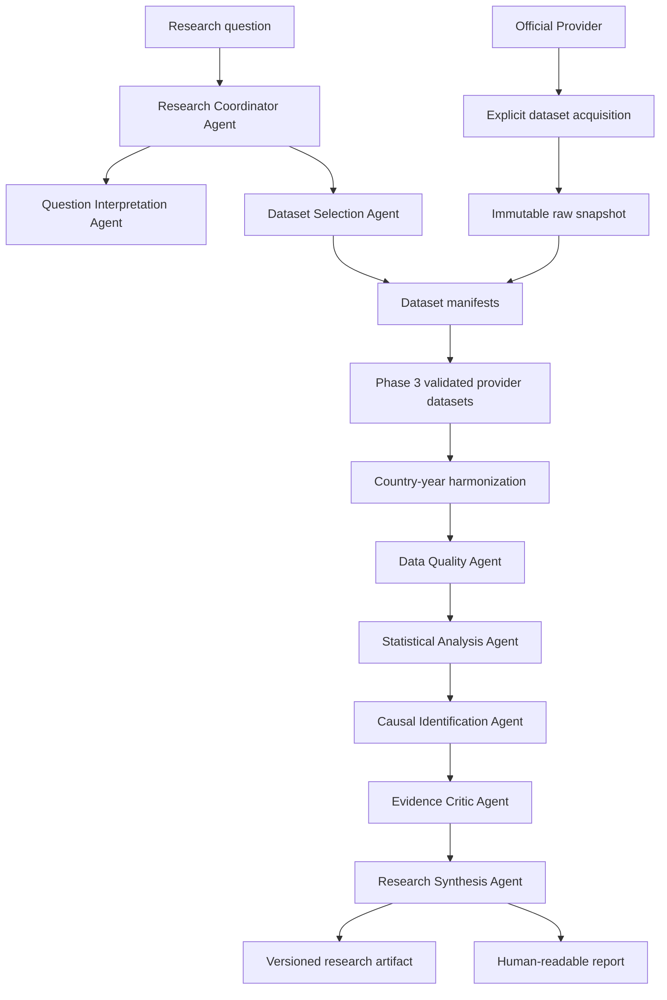

# System Overview

## Responsibilities

Polaris coordinates empirical investigations while preserving reproducibility, uncertainty, and methodological boundaries. The system is responsible for:

- classifying research questions;
- selecting candidate datasets;
- acquiring official public datasets as immutable local snapshots;
- recording provenance;
- running deterministic transformations and analyses;
- assessing data quality and causal-identification strength;
- synthesizing evidence without suppressing conflicts;
- generating versioned machine-readable artifacts and human-readable reports.

## High-Level Flow

## Deterministic Analytical Core

Data transformations, statistical calculations, causal estimates, diagnostics, and reproducible results remain deterministic. Agent strategies may vary internally, but external contracts must remain typed and structured.

## Dataset Acquisition

Provider access is an explicit pre-ingestion step. Polaris downloads or copies a provider file once, stores it under `data/raw/<provider>/`, records source URL, original filename, timestamp, byte size, format, and SHA-256 checksum, and generates a normal `DatasetManifest` under `data/manifests/`. Registry, ingestion, analysis, evidence, coordination, synthesis, and reporting operate from those local artifacts and do not require provider access after acquisition.

## Country-Year Harmonization

Phase 12 adds a deterministic layer between validated provider ingestion and analysis. It consumes immutable `DatasetIngestionResult` objects, explicit dataset configs, reviewed variable mappings, and a declared join type. It normalizes country and year identifiers, excludes aggregates from country-level joins by default, validates units and definitions, records duplicate keys and conflicts, tracks missingness reason codes, and preserves value-level provenance for each harmonized value. The output is a derived `HarmonizedDataset` that can be exported as a Phase 3-compatible CSV and manifest.

## Failure Handling

The system must stop or downgrade claims when:

- required metadata is missing;
- source coverage is inadequate;
- data definitions are not comparable;
- missingness undermines interpretation;
- model diagnostics fail;
- identification assumptions are not defensible;
- robustness checks are unstable;
- sources conflict.

## Provenance Flow

Every dataset, transformation, model output, and narrative claim must link to provenance records. Reports are generated from artifacts, not from untracked agent memory.

## Technology Position

Candidate technologies are listed in [Technology Decisions](technology-decisions.md). Phase 0 does not commit to a production stack.
