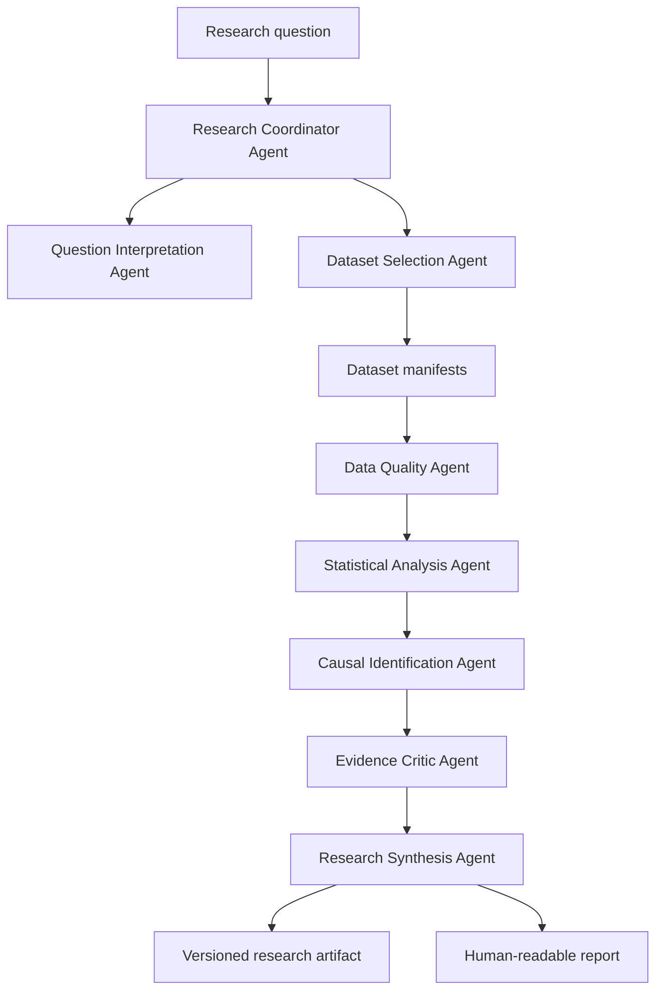

# System Overview

## Responsibilities

Polaris coordinates empirical investigations while preserving reproducibility, uncertainty, and methodological boundaries. The system is responsible for:

- classifying research questions;
- selecting candidate datasets;
- recording provenance;
- running deterministic transformations and analyses;
- assessing data quality and causal-identification strength;
- synthesizing evidence without suppressing conflicts;
- generating versioned machine-readable artifacts and human-readable reports.

## High-Level Flow

## Deterministic Analytical Core

Data transformations, statistical calculations, causal estimates, diagnostics, and reproducible results remain deterministic. Agent strategies may vary internally, but external contracts must remain typed and structured.

## Failure Handling

The system must stop or downgrade claims when:

- required metadata is missing;
- source coverage is inadequate;
- data definitions are not comparable;
- missingness undermines interpretation;
- model diagnostics fail;
- identification assumptions are not defensible;
- robustness checks are unstable;
- sources conflict.

## Provenance Flow

Every dataset, transformation, model output, and narrative claim must link to provenance records. Reports are generated from artifacts, not from untracked agent memory.

## Technology Position

Candidate technologies are listed in [Technology Decisions](technology-decisions.md). Phase 0 does not commit to a production stack.
